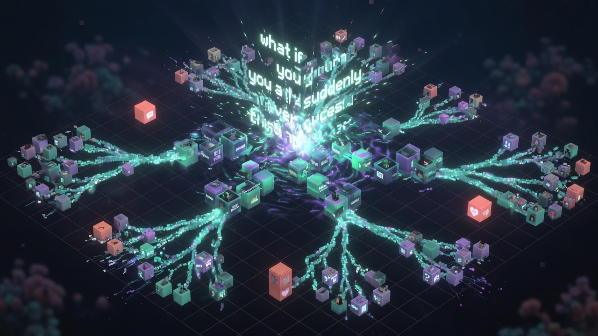

# Causality

**Work in progress.**

Causality is an experiment in hyperrealistic simulation — modeling how people react to a given set of words, and how the impulse of those initial words sets an entire closed system in motion, branching into new scenarios, personas, and collective behavior.

A scenario is decomposed into verbs and nouns arranged on a semantic gradient. Each word becomes a living cell with its own personality, memory, and disposition. When language is uttered into the field, cells resonate, cluster, and recombine — propagating the first impulse outward like a chain reaction through meaning itself.

The aim is not a static word cloud, but a breathing system where initial conditions matter: the words you seed determine who emerges, how they hear you, and what scenarios unfold from the first spark.

---

*This project is actively being built. Expect breaking changes, incomplete features, and rough edges.*